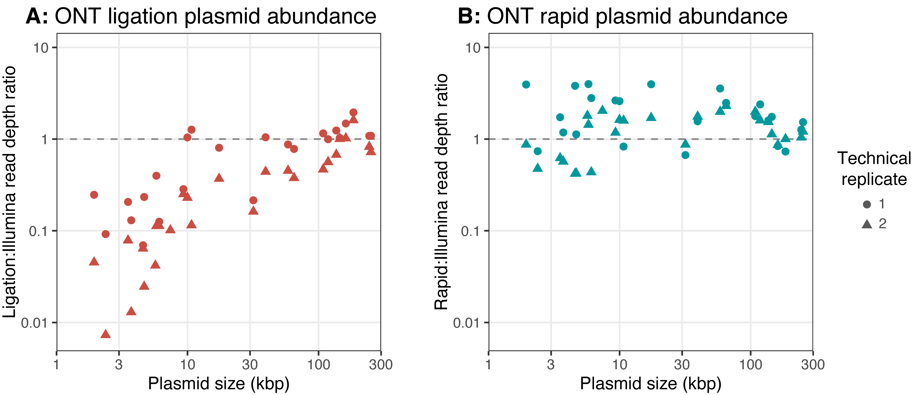
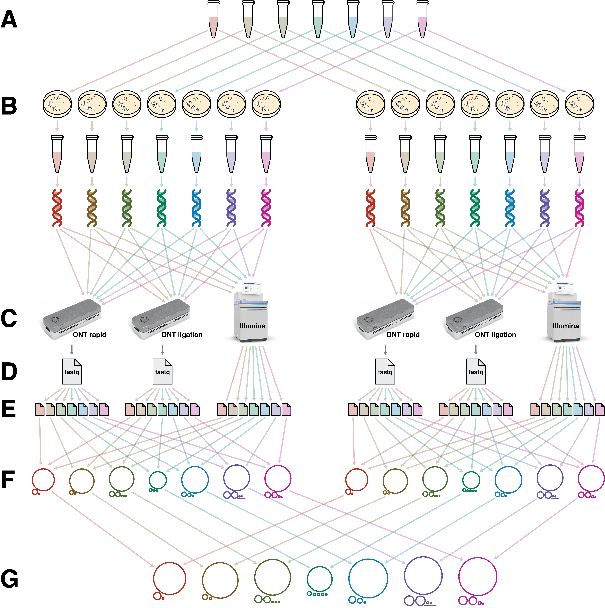

**Figure 1**: conceptual illustration of Oxford Nanopore ligation and rapid sample preparation methods. When circular DNA is extracted from a bacterial cell (top-left), incidental fragmentation of the DNA occurs. The ligation preparation (bottom-left) comprises blunt-end ligation of barcodes/adapters onto DNA molecules, so circular pieces of DNA will not receive adapters and thus remain unavailable for sequencing. The rapid preparation (right) uses a transposome enzyme to add barcodes/adapters into the middle of DNA molecules, making both linear and circular DNA available for sequencing.

    

**Figure 2**: plasmid abundance resulting from A) ligation and B) rapid ONT library preparation methods. Each point in the plots represents one plasmid, with circles for plasmids in the first technical replicate and triangles for plasmids in the second technical replicate.

The read depth ratio is the normalised ONT read depth divided by the normalised Illumina read depth. The dashed lines at ratio=1 indicate perfect agreement of plasmid depths between ONT and Illumina data. Points above the dashed lines indicate plasmids that are overrepresented in ONT reads, while points below the dashed lines indicate plasmids that are underrepresented in ONT reads.

For ONT ligation reads (A), small plasmids are systematically underrepresented relative to Illumina reads. For ONT rapid reads (B), plasmid size has no clear effect, and depths for both small (<20 kbp) and large plasmids (≥20 kbp) are in good agreement with Illumina reads.

    

**Figure S1**: a diagrammatic representation of the study approach for the culturing, sequencing and assembly steps.

A. Seven bacterial isolates from seven different species: _A. baumannii_, _C. koseri_, _E. kobei_, _Haemophilus_ (unnamed species), _K. oxytoca_, _K. variicola_ and _S. marcescens_.

B. Each isolate was cultured and DNA was extracted in two separate technical replicates.

C. For each technical replicate, the DNA was multiplexed and sequenced using three different methods: ONT with a rapid preparation, ONT with a ligation preparation and Illumina.

D. Each ONT sequencing run produced a set of basecalled reads (pre-demultiplexing). These whole-run pooled reads were not available for the Illumina runs because they included isolates from other studies.

E. After demultiplexing, reads were available in per-genome files.

F. Genome assemblies were carried out using all available ONT and Illumina reads for each isolate. To account for the possibility of genomic differences between the two technical replicates, assemblies were performed on a per-replicate basis.

G. Assemblies for the two technical replicates were reconciled with each other to produce a single assembly for each isolate.

    

**Figure S2**: reference genome assemblies for the seven isolates used in this study (replicon sizes not drawn to scale).

    

**Figure S3**: the association between GC content on Illumina read depth. Each green point represents a 1 kbp sequence window from the chromosome of a genome in this study, where read depth was normalised using the mean depth for 49–51% GC windows. The dark green line is a LOESS regression curve fitted to the points. The blue points on the top of the plot show the mean GC content of each plasmid in the study genomes.

    

**Figure S4**: two-sided Manhattan plots for read-start density in each of the replicons from both library preparation types. Each point represents a 100-bp window in which the number of read-start events was quantified. A _p_-value was determined for each read-start count by comparing against a Poisson distribution with a mean equal to the replicon’s mean read-starts per window: for a window with _k_ read-starts and a Poisson with mean _λ_, if _k_ > _λ_ then _p_ = _P_(_X_ ≥ _k_) and if _k_ < _λ_ then _p_ = _P_(_X_ ≤ _k_). Points above the zero-line indicate more read-starts than expected from the Poisson distribution, and points below the zero-line indicate fewer read-starts than expected from the Poisson distribution. Dashed lines indicate Bonferroni-corrected _p_=0.05 levels, and points outside the dashed lines are statistically significant deviations from a Poisson distribution.

Ligation read sets showed more localised deviations from the Poisson distribution than rapid read sets, suggesting some parts of the sequence are more or less prone to breakage than others. This was especially true for the _Haemophilus_ M1C132_1 and _S. marcescens_ 17-147-1671 genomes.

Repetitive sequence regions were excluded from this analysis because they contained unreliable read alignments. _E. kobei_ plasmid 5 and _S. marcescens_ plasmid 3 were excluded because they contained multiple variants with different sequence lengths.

    

**Figure S5**: the read N50 length for each demultiplexed read set in each of the four ONT sequencing runs.

    

**Figure S6**: read identity distributions for each of the four ONT sequencing runs. The dashed lines represent median read identity.

    

**Figure S7**: pore translocation speed vs read time for the first 24 hours of each of the four ONT sequencing runs. Each dot represents a single read. The ligation 1 and rapid 1 runs were refueled with the EXP-FLP002 kit 18 hours into the run (dashed line).

    

**Figure S8**: read identity vs read time for the first 24 hours of each of the four ONT sequencing runs. Each dot represents a single read. The ligation 1 and rapid 1 runs were refueled with the EXP-FLP002 kit 18 hours into the run (dashed line).
